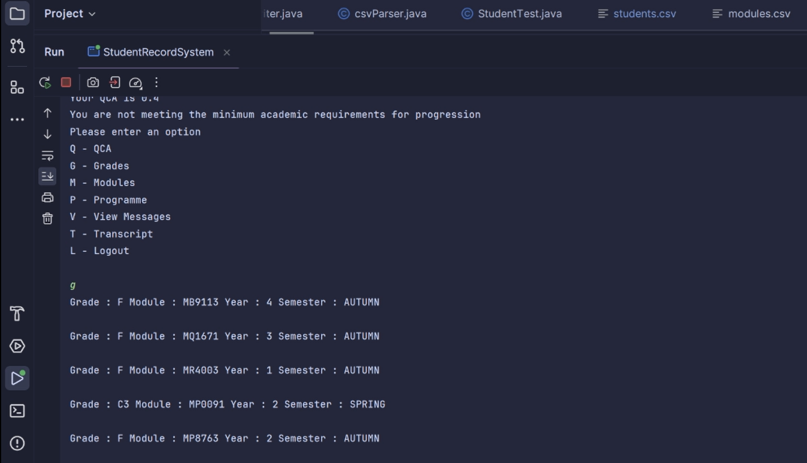
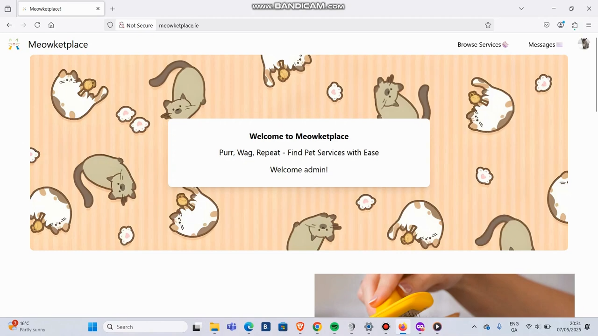
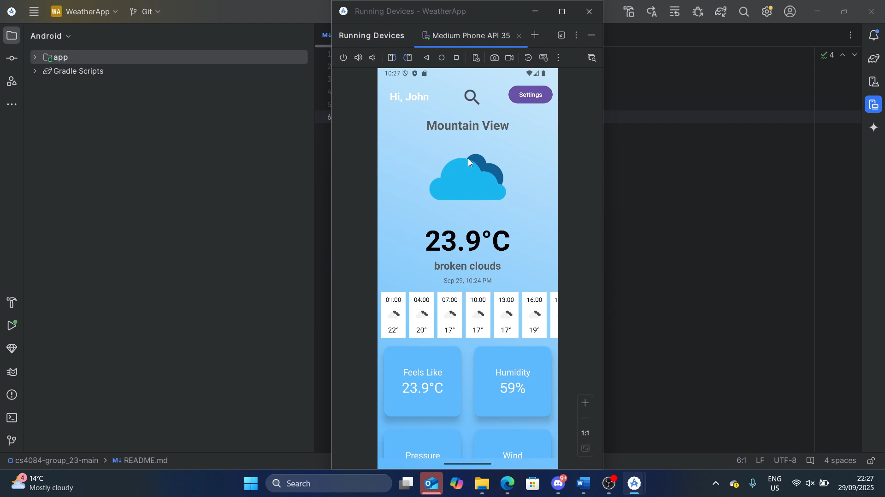

# Portfolio – Caylum Hurley

This portfolio showcases software development projects completed during my Computer Science degree at the University of Limerick. Each project demonstrates a mix of **desktop, web, and mobile development**, as well as problem-solving, design, and documentation skills.

---

## Projects

### 1. UL Student Records System – CS4013
A **Java-based student records system** for managing transcripts, grades, and progression at UL.  
- **Tech:** Java (OOP), CSV files, CLI interface  
- **Key Features:** Student/faculty access, QCA calculations, progression tracking, exam board tools  
- **Screenshot:**  

---

### 2. Meowketplace – CS4116
A **business service marketplace** for pet-related services.  
- **Tech:** PHP, HTML, CSS, Bootstrap, React, MySQL/MariaDB  
- **Key Features:** User/business accounts, service listings, messaging & negotiation, verified reviews, admin controls  
- **Screenshot:**  

---

### 3. Weather App – CS4084
An **Android weather app** providing forecasts, maps, and favourite locations.  
- **Tech:** Java/Kotlin, Android Studio, Activities & Fragments, API integration  
- **Key Features:** Home dashboard, weather maps, forecast details, persistent login, settings  
- **Screenshot:**  

---

### 4. Class Scheduler Application – CS4076
A **TCP client-server application** for scheduling classes with clash detection and rescheduling.  
- **Tech:** Java, Swing GUI (client), console server, TCP sockets  
- **Key Features:** Add/remove classes, display schedules, early lecture rescheduling, custom exception handling  
- **GIF Demo:**  

---

## Skills Demonstrated
- **Languages:** Java, PHP, JavaScript, SQL, Kotlin 
- **Frameworks & Tools:** React, Bootstrap, Android Studio, Swing  
- **Concepts:** OOP, Event-Driven Programming, Client-Server Communication, Database Design, API Integration  
- **Software Engineering:** UML/CRC diagrams, documentation, Git/GitHub version control, deployment

---

## About This Portfolio
This portfolio highlights a variety of development work across **web, desktop, and mobile platforms**, demonstrating both **technical skills and the ability to deliver functional, user-focused software systems**. Each project includes clear documentation and visual previews to help employers quickly understand the work completed.

---

### Contact
- **Email:** caylumhurley@gmail.com
- **Github:** [CaylumH](https://github.com/CaylumH)
